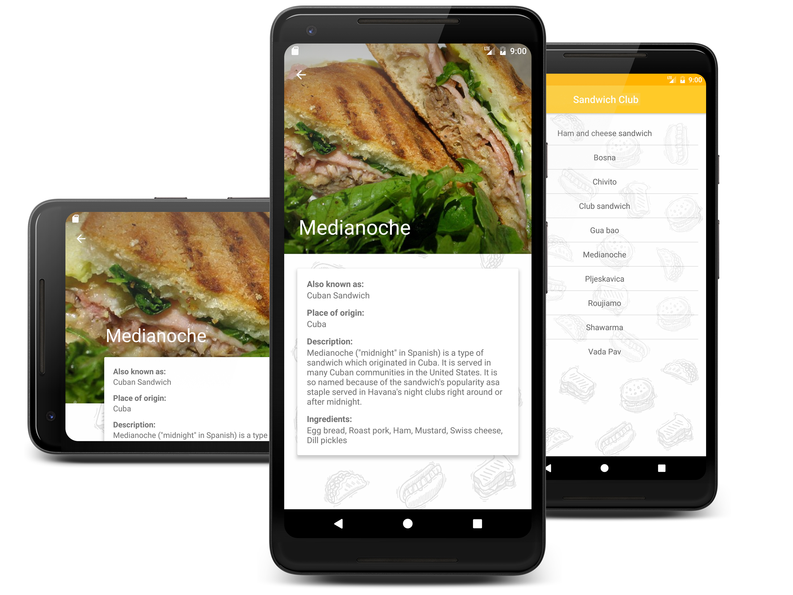

# Sandwich Club

*Udacity’s Android Developer Nanodegree project*  

This Android app allows users to discover the different types of most popular sandwiches around the world. It shows the  
details of each sandwich once it is selected. It contains a photo of and detailed information about every sandwich: place  
of origin, ingredients and a short description.

## Libraries

- Gson
- Picasso
- ButterKnife

## Screenshots

 

 
 
 

  

 
 
  

  

  

## License

    Copyright 2018 Attila Kasza

    Licensed under the Apache License, Version 2.0 (the "License");
    you may not use this file except in compliance with the License.
    You may obtain a copy of the License at

        http://www.apache.org/licenses/LICENSE-2.0

    Unless required by applicable law or agreed to in writing, software
    distributed under the License is distributed on an "AS IS" BASIS,
    WITHOUT WARRANTIES OR CONDITIONS OF ANY KIND, either express or implied.
    See the License for the specific language governing permissions and
    limitations under the License.
